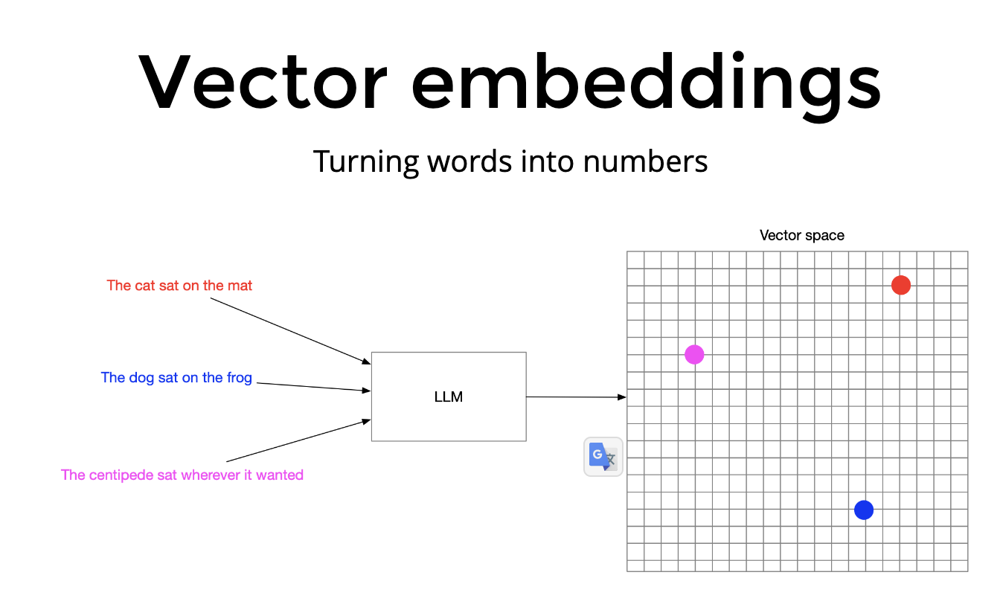
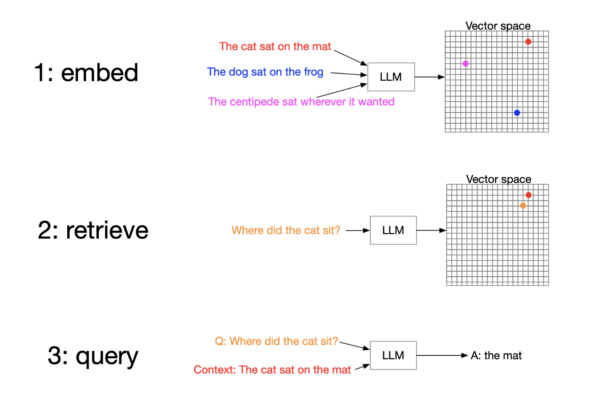
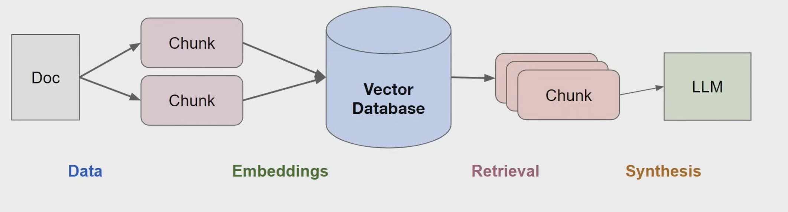
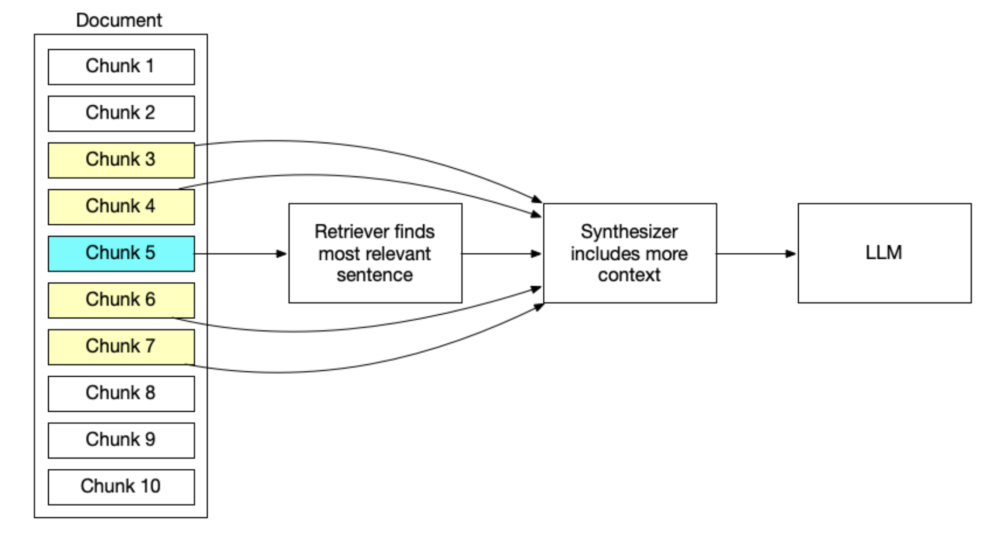
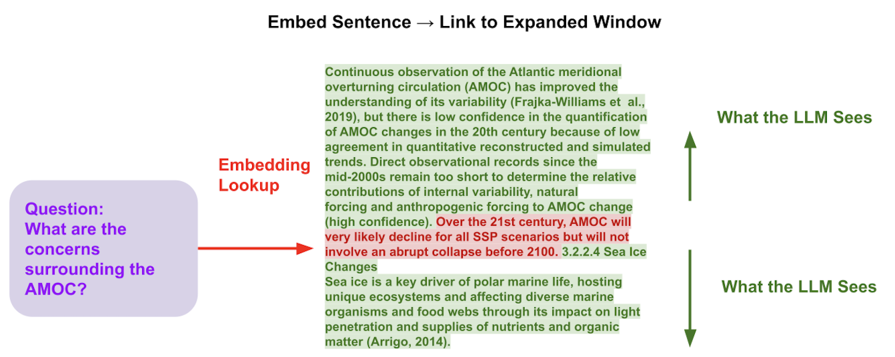
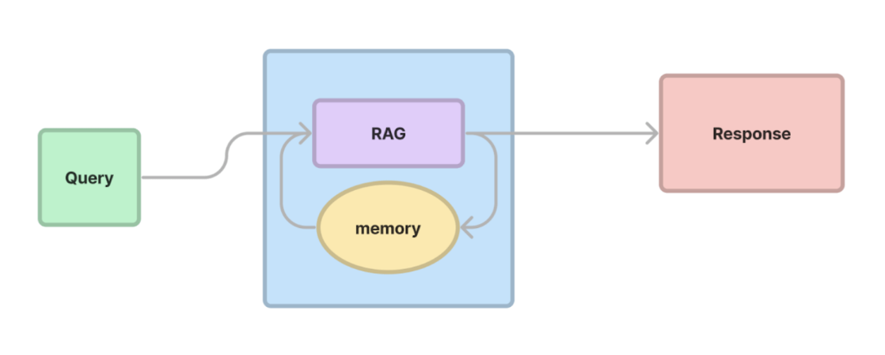
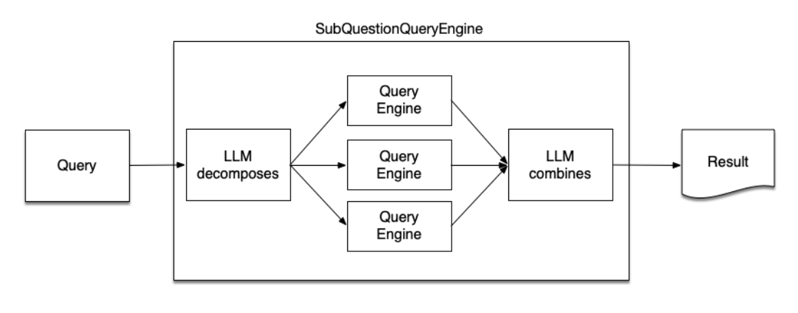
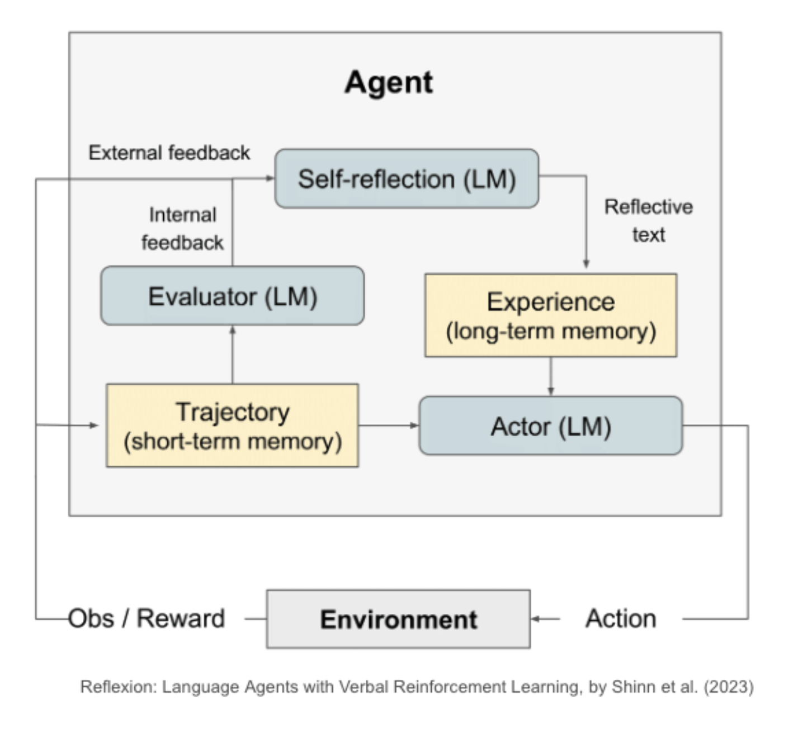

# RAG System (Improve RAG with advanced techniques)

## What is RAG?

Retrieval-Augmented Generation (RAG) is the process of optimizing the output of a large language models (LLMs), it helps LLMs refer to external knowledge outside of training data sources before generating a response. RAG extends the already powerful capabilities of LLMs to specific domains or an organization's internal knowledge base, without the need to retrain the model.

RAG is reponse to limitation of LLMs, they are trained on mountains of data but they're not trained on your data. Your data sit behind your Firewall where OpenAI can't see it. If you want LLM process your data, you have to give it to them.

But you can not just give LLM all of your data at once - at the momment, because they simply can't handle it. If you give ChatGPT all your docments at once it will limit by context windows. Even in a universe where you have LLMs that had infinite context Windows it would still not be practical to give llm all of your data every time. You have to be selective which is where the retrieval part of retrieval augmented generation comes in.

In addition, the LLMs generation is often plagued by a problem called `hallucination`, where the models generate sentences that sound fluent and logical, but are in fact incorrect. The RAG technique was born as a method to solve this problem.

<!-- ## What are the benefits of RAG?

### Cost-effective implementation

RAG is a more cost-effective approach to introducing new data to the LLM, without the need to retrain the model.

### Current information (Recency)

RAG allows developers to provide the latest research, statistics, or news to the generative models. They can use RAG to connect the LLM directly to live social media feeds, news sites, or other frequently-updated information sources. The LLM can then provide the latest information to the users.

### More developer control

With RAG, developers can test and improve the chat applications more efficiently. Developers can control and change the LLM's information sources, also restrict sensitive information retrievaland ensure the LLM generates appropriate responses. -->

## How to perform RAG

The core of RAG is `Retrieval` and there are some ways to do that at the highest level.

- Key word search: This is the traditional way, the same algorithms that we have been using in search engines, it works well for exact query-keyword matches.
- Structured queries: If you have a relational DB it doesn't make sense to dump it all to text and give it to an LLM. Because you have all of this valuable relational data about how this data relates to the other data in your DB. So instead, LLM are getting pretty good at writing SQL, you can get the LLM to query your database directly and retrieve data that way.
- Vector search: Vector search powers semantic or similarity search. Since the meaning and context is captured in the embedding, vector search finds what users mean, without requiring an exact keyword match.

#### 1. Vector embeddings

Converting text into number is therefore know as embedding text into Vector space and the resulting numbers are just called `embeddings` for short.

### 2. Search by meaning

### 3. Feed to LLMs

So, that we do RAG
- Embedding data
- Embedding the query
- Retrive context that's nearby to query in vector space
- Feed the context and query to an LLM, and get a completion for your query.

RAG pipeline

You can use it amazing Vector search or you can you Keyword search or structured queries but of course you can do even better and use all three at the same time.

## RAG challenges
  - Accuragy
  - Faithfulness
  - Recency
  - Provenance 

## Advanced RAG Techniques

### Chunking

Choosing the right context is very important. When you have a large chunk embeddings, it's hard to LLM for find the right context. So it very important to have the right `chunk size`. It's usually better to have a smaller chunk of embeddings rather than ones. That help LLMs can easier time finding the most relevant.

However, finding the right chunk size will require many iterations and experimentations. 
But LlamaIndex and Langchain allow you to set up an experiment with different chunk sizes quite easily. It can take a bit of time, but actually helps improve response times, relevancy, and also faithfulness.

### Small-to-big retrieval

Small-to-big technique: First we retrieve smaller chunks of text and then use those smaller chunks to identify the relevant larger chunks.

For example, we break a large document up into very small chunks like single sentences and we perform retrieval on those very specific sentences for maximum precision. But that sentence by itself while it's very closely related to the query, might not be enough context to answer the question. So at the synthesis stage before we hand the query and the context to LLM we back to retrieve five or 10 sentences of worth of context before and after the sentence we retrieved. This gives the LLM more context to work with while maintaining the Precision that we wanted.

## Conversation memory

Conversation memory, this is theoretically simple. As you run query, you include all history as context to your further queries.

In LlamaIndex you can learn about ChatEngine, this interface has been built to support Conversation memory.

## Sub Question Query Engine

For next advance technique, we have Sub Question Query Engine.

Sub Question Query Engine is a specialized component designed to handle complex queries by breaking them down into smaller, more manageable sub-questions.

How it Works:
- *Query Decomposition*: We use the LLM to take a complex query and analyze it to identify potential sub-questions that can be answered independently. 

- *Sub-Question Routing*: Each sub-question is then directed to the most appropriate data source or retrieval function. This ensures that each question is answered using the most relevant and accurate information available.
- *Response Synthesis*: The engine collects the answers to all the sub-questions and synthesizes a final response that addresses the original complex query.

## Self reflection 

Self-Reflection refers to the ability of the RAG system to evaluate its own generated responses and decide whether they are accurate, relevant, and complete.

The LLM can tell whether the LLM is doing a good job you can also of course get a human in the loop to tell the agent whether it's getting closer to its goal.
How it Works:

1. Information Retrieval
2. Generate Response : Based on the retrieved information, the system generates an initial response
3. Self-Assessment: The system evaluates the initial response by considering factors such as, accuracy, completeness
4. Refinement and Improvement: Based on the self-assessment results, the system can refine and improve the initial response, or simply re-Generate Respone

# REF
https://aws.amazon.com/vi/what-is/retrieval-augmented-generation/
https://docs.llamaindex.ai/en/stable/optimizing/advanced_retrieval/advanced_retrieval/#main-advanced-retrieval-strategies
https://www.youtube.com/watch?v=MXPYbjjyHXc
https://slides.com/seldo/rag-and-agents
https://docs.llamaindex.ai/en/stable/examples/agent/multi_document_agents/
